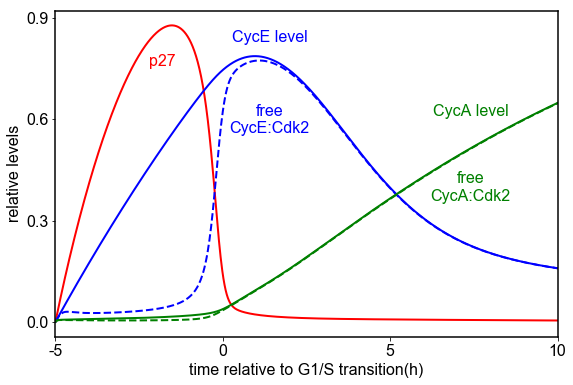

# Barr2016 
Barr, A. R., Heldt, F. S., Zhang, T., Bakal, C. & Novák, B. A Dynamical Framework for the All-or-None G1/S Transition. *Cell Syst.* **2**, 27–37 (2016). https://doi.org/10.1016/j.cels.2016.01.001

## Run Simulation and View Results
```python
%matplotlib inline
from run_sim import run_simulation
run_simulation()
```
