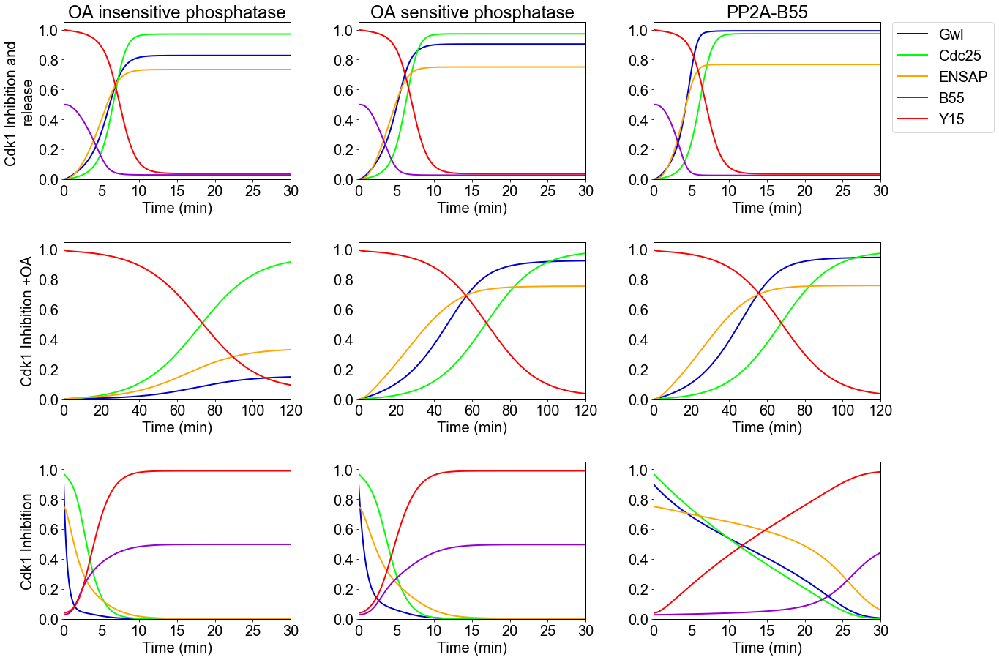

# Hegarat2014
Hégarat, N. *et al.* PP2A/B55 and Fcp1 Regulate Greatwall and Ensa Dephosphorylation during Mitotic Exit. *PLoS Genet.* **10**, (2014). https://doi.org/10.1371/journal.pgen.1004004

## Run Simulation and View Results
```python
%matplotlib inline
from run_sim import run_simulation
run_simulation()
```
