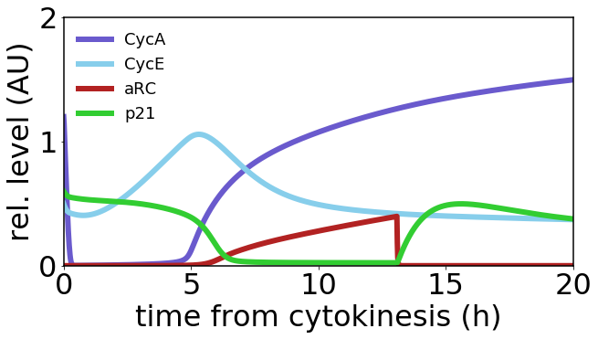

# Heldt2018 
Heldt, F. S., Barr, A. R., Cooper, S., Bakal, C. & Novák, B. A comprehensive model for the proliferation–quiescence decision in response to endogenous DNA damage in human cells. *Proc. Natl. Acad. Sci.* **115**, 2532–2537 (2018). https://doi.org/10.1073/pnas.1715345115

## Run Simulation and View Results
```python
%matplotlib inline
from run_sim import run_simulation
run_simulation()
```


## License
[MIT](/LICENSE)