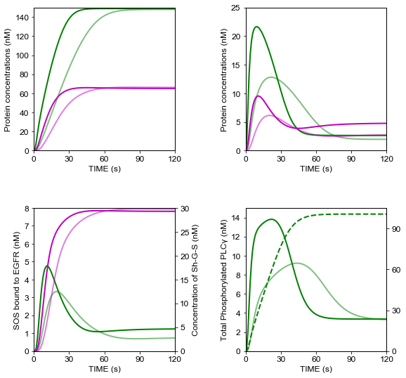

# Kholodenko1999
Kholodenko, B. N., Demin, O. V, Moehren, G. & Hoek, J. B. Quantification of short term signaling by the epidermal growth factor receptor. *J. Biol. Chem.* **274**, 30169–30181 (1999). https://doi.org/10.1074/jbc.274.42.30169

## Run Simulation and View Results
```python
%matplotlib inline
from run_sim import run_simulation
run_simulation()
```
