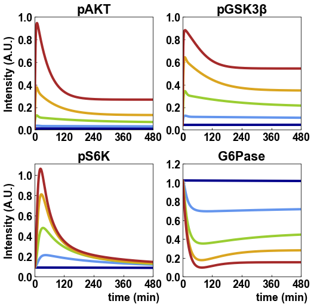

# Kubota2012
Kubota, H. *et al.* Temporal Coding of Insulin Action through Multiplexing of the AKT Pathway. *Mol. Cell* **46**, 820–832 (2012). https://doi.org/10.1016/j.molcel.2012.04.018

## Run Simulation and View Results
```python
%matplotlib inline
from run_sim import run_simulation
run_simulation()
```
