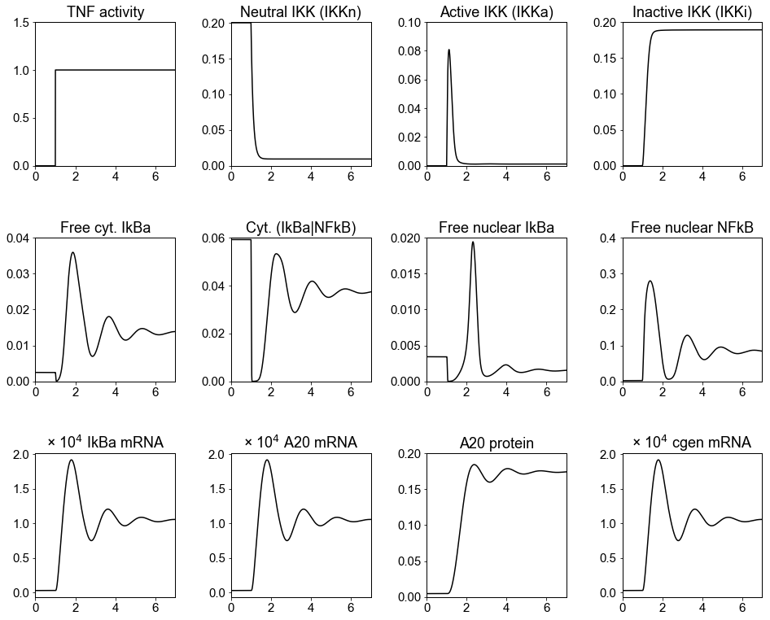

# Lipniacki2004
Lipniacki, T., Paszek, P., Brasier, A. R., Luxon, B. & Kimmel, M. Mathematical model of NF- κB regulatory module. *J. Theor. Biol.* **228**, 195–215 (2004). https://doi.org/10.1016/j.jtbi.2004.01.001

## Run Simulation and View Results
```python
%matplotlib inline
from run_sim import run_simulation
run_simulation()
```


## License
[MIT](/LICENSE)