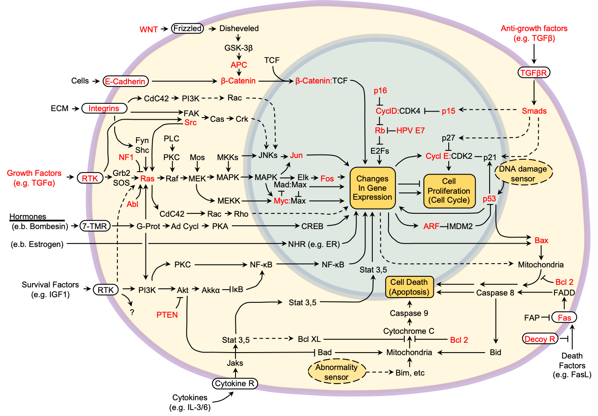

# Computational modeling of signaling pathways in cancer
The Emergent Integrated Circuit of the Cell

Hanahan, D. & Weinberg, R. A. The hallmarks of cancer. *Cell* **100**, 57–70 (2000). https://doi.org/10.1016/S0092-8674(00)81683-9

## Models
- ErbB signaling pathway
    - [Kholodenko1999](./Kholodenko1999)
    - [Hatakeyama2003](https://github.com/okadalabipr/Hatakeyama2003)
    - [Birtwistle2007](https://github.com/okadalabipr/Birtwistle2007)
    - [Hass2017](./Hass2017)

- Insulin signaling pathway
    - [Kubota2012](./Kubota2012)
    
- Immediate-early gene response
    - [Nakakuki2010](https://github.com/okadalabipr/Nakakuki2010)

- NF-κB pathway
    - [Lipniacki2004](./Lipniacki2004)
    - [Shinohara2014](https://github.com/okadalabipr/Shinohara2014)
    - [Inoue2016](https://github.com/okadalabipr/Inoue2016)
    - [Oppelt2018](./Oppelt2018)

- Cell cycle
    - [Hegarat2014](./Hegarat2014)
    - [Barr2016](./Barr2016)
    - [Heldt2018](./Heldt2018)

 - TGF-β/Smad signaling pathway
    - [Zi2011](./Zi2011)

- JAK/STAT signaling pathway
    - [Raia2011](./Raia2011)

- p38 MAPK pathway
    - [Tomida2015](./Tomida2015)

- DNA damage response pathway
    - [Yang2018](./Yang2018)

## License
[MIT](LICENSE)