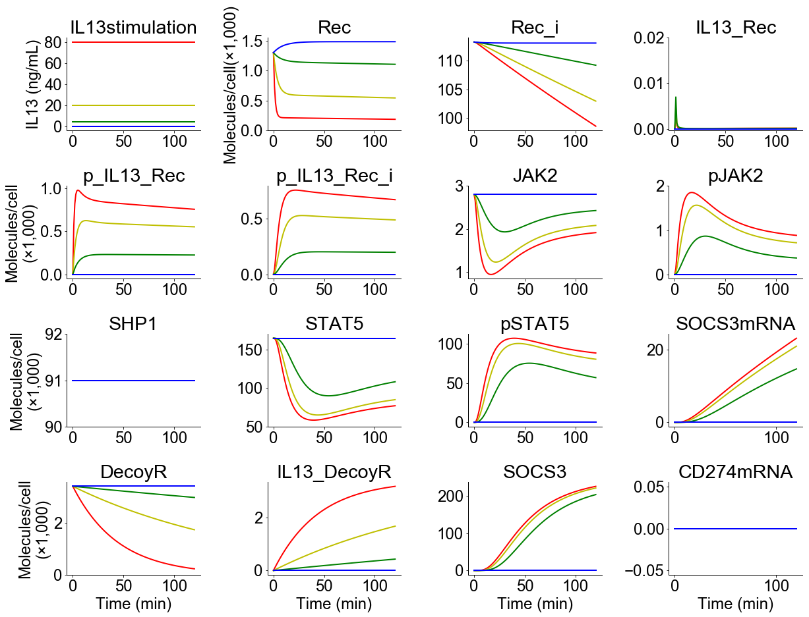

# Raia2011
Raia, V. *et al.* Dynamic mathematical modeling of IL13-induced signaling in Hodgkin and primary mediastinal B-cell lymphoma allows prediction of therapeutic targets. *Cancer Res.* **71**, 693–704 (2011). https://doi.org/10.1158/0008-5472.CAN-10-2987

## Run Simulation and View Results
```python
%matplotlib inline
from run_sim import run_simulation
run_simulation()
```
