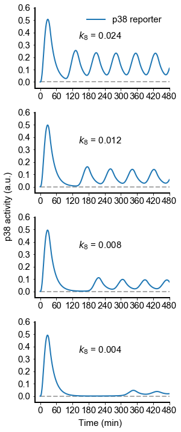

# Tomida2015
Tomida, T., Takekawa, M. & Saito, H. Oscillation of p38 activity controls efficient pro-inflammatory gene expression. *Nat. Commun.* **6**, 1–9 (2015). https://doi.org/10.1038/ncomms9350

## Run Simulation and View Results
```python
%matplotlib inline
from run_sim import run_simulation
run_simulation()
```


## License
[MIT](/LICENSE)