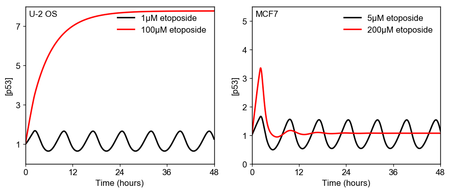

# Yang2018
Yang, R. *et al.* Cell type–dependent bimodal p53 activation engenders a dynamic mechanism of chemoresistance. *Sci. Adv.* **4**, (2018). https://doi.org/10.1126/sciadv.aat5077

## Requirements
- **[Julia 1.0+](https://julialang.org)**
    - [DelayDiffEq](https://github.com/JuliaDiffEq/DelayDiffEq.jl)
    - [PyPlot](https://github.com/JuliaPy/PyPlot.jl)
    - [IJulia](https://github.com/JuliaLang/IJulia.jl)

## Run Simulation and View Results
```julia
include("Yang2018.jl")
using .Yang2018
runSim()
```


## License
[MIT](/LICENSE)
